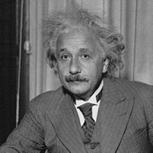

### Install Python , numpy , opencv 

 ##### First step: reading the pictures

 ##### Second step: making a composite image

 ##### The third step: making a negative image

 ##### Fourth step: work with color channels

