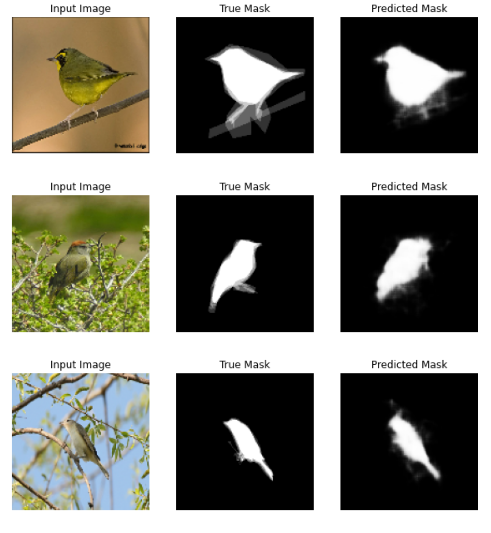
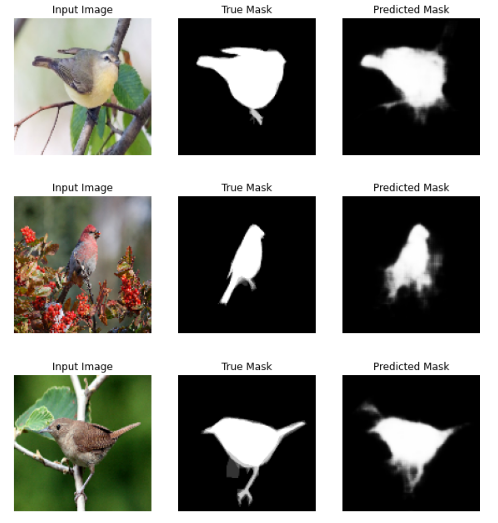
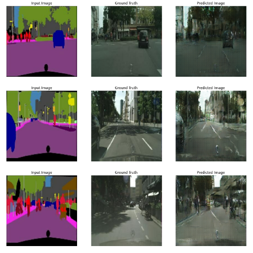
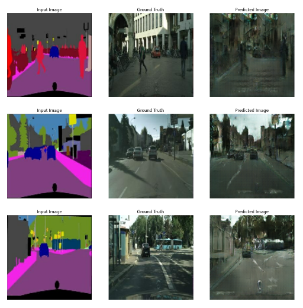

### implementation of Semantic segmentation for caltech_birds2011 dataset using UNet network (tensorflow)

###  implementation of Semantic segmentation for cityscapes dataset using pix2pix network (tensorflow) 

