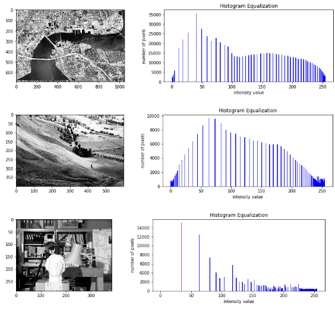
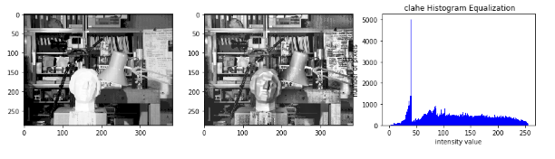
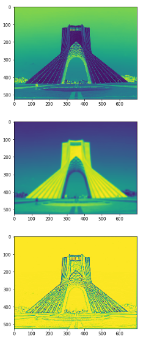

### :Question: #2: Image enhancement operation

##### A) Draw the histogram of the images

##### B) By implementing and using the histogram stretching method, improve the contrast of the images, then draw the improved images along with their histogram.

##### C) By implementing and using the histogram cutting method, improve the images, then draw the improved images along with their histogram.

##### D) Implement the histogram balancing function and apply it to the images

### :Question: #4: Implement the Pencil Sketch filter

##### A)Implement the function gaussian_kernel in such a way that by receiving the size of the kernel and the standard deviation, it calculates the coefficients of the desired two-dimensional Gaussian filter and returns the kernel.

##### B)Implementing convolve2d function

##### C) apply the Pencil Sketch effect on the Azadi.jpg image

*** result

