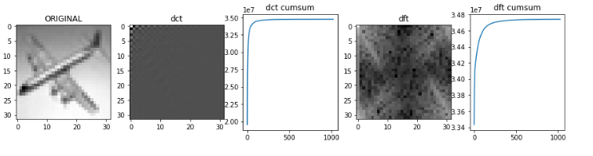
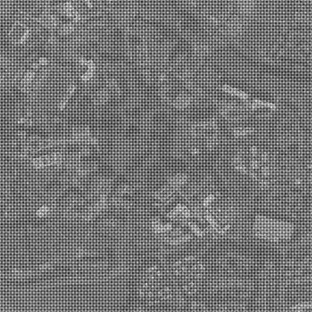
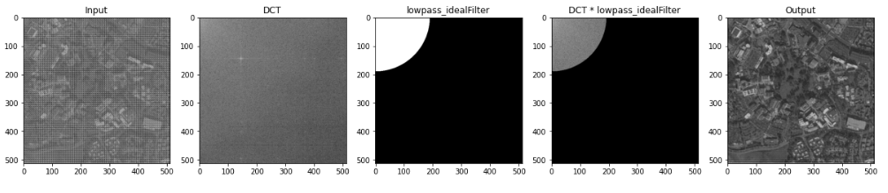
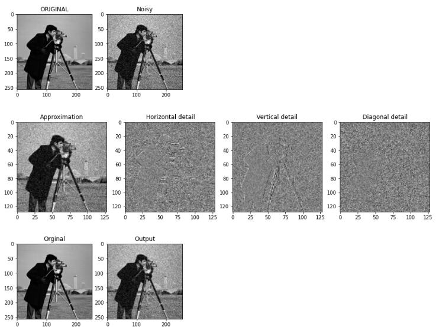
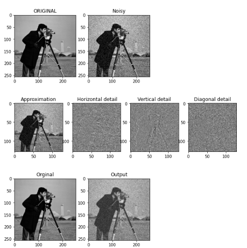

#### :Question: #2: Consider image 1.bmp and calculate the following :

######  A) Two-dimensional DFT and DCT. Display the results.
######  b) For each of the two images, arrange the absolute value of the resulting coefficients from the largest to the smallest.
######  c) Draw the cumulative sum to the power of 2 of these values.

#### :Question: #3: Reduce the image noise by applying an ideal low-pass filter on the 2.jpg image.

###### **** 1- First, implement the filter function according to its formula. Consider the center of the filter as the point (0 and 0).

###### **** 2- Obtain the two-dimensional DCT of the image. 
###### ***** Multiply the created filter by the output of the previous step.
   
###### **** 3- Obtain the inverse of the DCT

#### :Question: #4: Using the wavelet transform function, reduce the noise of the 3.bmp image in the following two ways and compare it with the noise-free image 4.bmp using the PSNR criterion.

######  A) One-step analysis of the image and complete removal (zeroing) of parts 𝑊𝐽𝐻−1, 𝑊𝐽𝑉−1, 𝑊𝐽𝐷−1

######  b) Decomposing n-phase images and using thresholding for Noise reduction of 𝐷𝑊, 𝑉𝑊, 𝐻𝑊.

