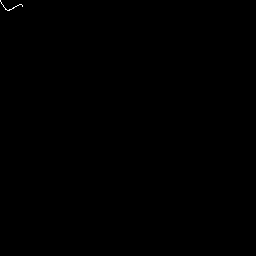
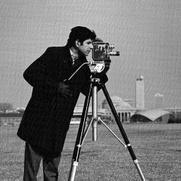
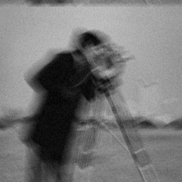
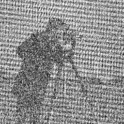

#### :Question: #2: Convert the string of coefficients into an 8x8 image using the jpeg decoding algorithm and save it in bmp format.

*** result

#### :Question: #(4-1) : Noisy image cam_1.bmp was taken without any processing and also the image of the motion sensor signal inside the camera is also available. Represent image cam_1.bmp using camera sensor image and inverse filter method.

              

#### :Question: #(4-2) :If after some time the noise of the camera increases and the cam_2.bmp image is taken, then  What is output of an inverse filter? Get the type of noise model and its parameters based on cam_2.bm

              

*** we can see that each patch of cam_2 image have a normal noise so we should calculate prameter of normal distrubition

