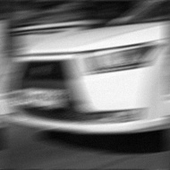
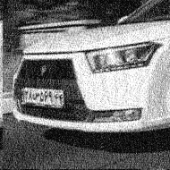

####  :Question: #(1-1): Image Khayyam.jpg has been registered by someone. This image is blurred due to shaking of the person's hand. Suppose the camera noise is very low and can be ignored and the movement model in the location space is in the form of psf1.bmp. Remove motion blur by using the Wiener filter.

            

*** Output of Wiener filter

####  :Question: #(1-2): The image car.jpg is recorded from a moving car. We want to read the license plate of the car. Here we don't know the camera movement model. Also, the camera has some unknown noise. Reconstruct the image using the Wiener filter and display the license plate.

*** Output of Wiener filter for display the license plate and camera movement model

####  :Question: #(2-1): Get the Sobel gradient size of each webcam frame, then threshold it so that pixels with values greater than the threshold are considered 255 and the rest 0 . (3-2) Using the cv2.Canny function, get the image edges of each frame.

####  :Question: (2-2): Using the cv2.Canny function, get the image edges of each frame.

####  :Question: (3-1): One of the problems of Hough transform is not using gradient angle. Write a program that extracts the lines in the image using the Hough transform, but also uses the gradient angle during voting.

####  :Question: (3-2): Using cv2.HoughCircles appropriate arguments, count the number of coins in the image coin.jpg

