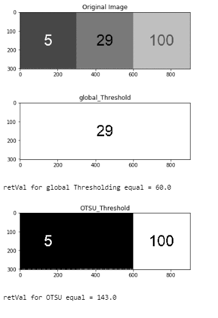
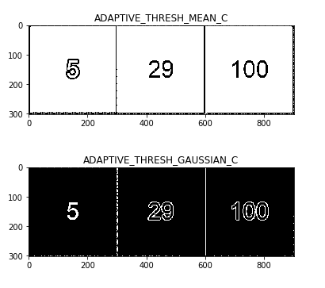
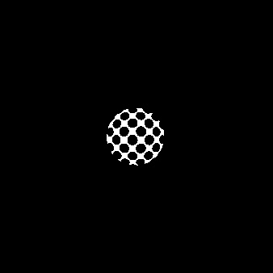
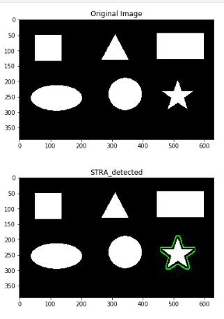

### :Question: #1: Morphology operation for convert the left side image to the right image (implementing)

### :Question: #2: Convert the image to binary using 

##### (2-1)(2-2): using global_Thresholding and OTSU_Thresholding

##### (2-3). using Adaptive Thresholding

### :Question: #3: Implementing region_growing algorithm 

*Result 

### :Question: #4: sُuitable Geometric feature  for star detection in the image 

