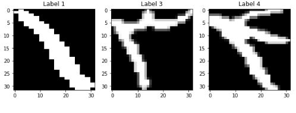
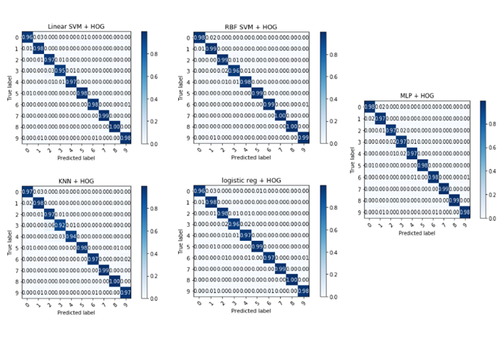
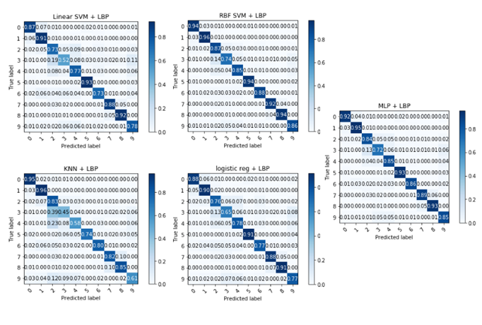
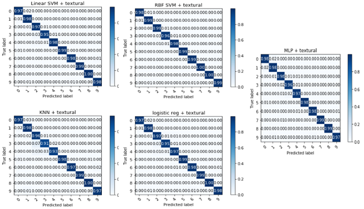

### :dart: Train and evaluation for [Farsi Handwritten Digit Recognition](https://github.com/amir-saniyan/HodaDatasetReader) using:

           * Shape and Texture for Feature Extraction
           * SVM, kNN, RBF SVM, logistic regression, MLP for Classification
           * Confusion Matrix for evaluation
           * Comparison 
           * Train and evaluation of Farsi Handwritten Digit using deep learning

* Some sample of Farsi Handwritten Digit images

*GOALS

* Use Features such a texture and geometry 
* Use SVM, kNN, RBF SVM, logistic regression, MLP for learning process as mandatory classifiers
* Evalute model using confustion matrix and average accuracy
* Compare results w.r.t. different features

#### :dart: Geometric Features 

#### :dart: HOG 

#### :dart: LBP

#### :dart: TEXTURAL Featuers 

## :dart: deep learning

