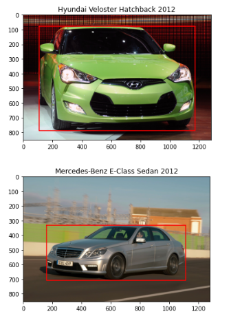
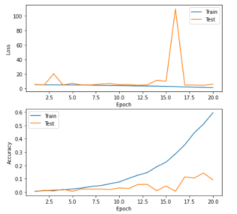
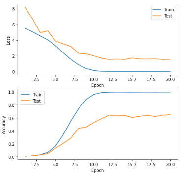
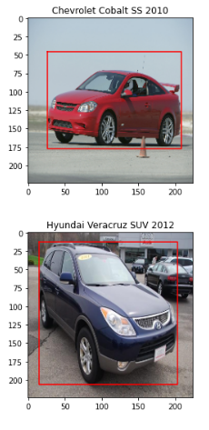
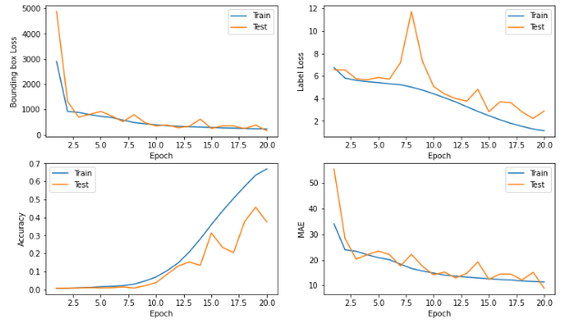
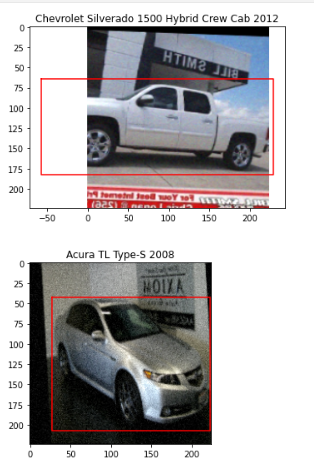
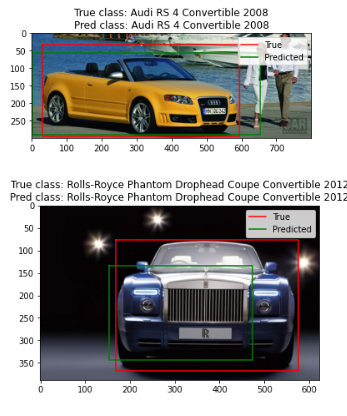

### :dart: _implementing of classification and localization on [CARS](https://ai.stanford.edu/~jkrause/cars/car_dataset.html) dataset._
---

#### step # 0 : Download Dataset and preprocessing 

#### step # 1 : define a Generator 

#### step # 2 : train ResNet50 model on training data just for classification task (without augmentation and just use random weight) and evaluate on test data.

#### step # 3 : train  ResNet50 model on Imagenet dataset just for classification task by Fine-Tuning (without augmentation and just use pretrain weight ) and evaluate on test data.

#### step # 4 : train  ResNet50 model on Imagenet dataset just for classification task by Fine-Tuning ( use augmentation, pretrain weight, add Dropout layers ) and evaluate on test data.

#### step # 5 : train  ResNet50 model on Imagenet dataset for classification  and localization task by Fine-Tuning ( use augmentation, pretrain weight, add Dropout layers ) and evaluate on test data.

