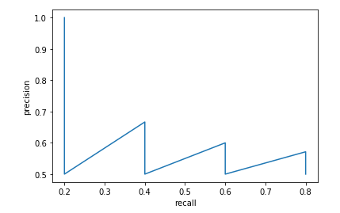
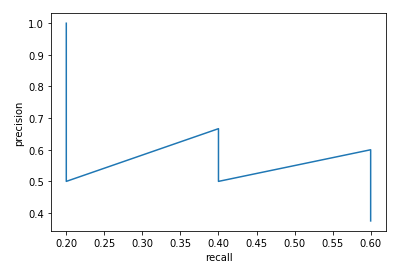
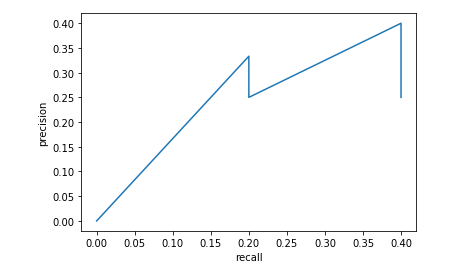

## :question:Using template matching, write programs that read a license plate number (in this exercise only reading numbers that are desired and there is no need to recognize non-numeric characters).

### :dart: [Matching Template](https://docs.opencv.org/2.4/modules/imgproc/doc/object_detection.html?highlight=matchtemplate)

* you can see result as illustrate below:

## :question:The ground-truth.xlsx and detections.xlsx files specify the reference rectangles and detected rectangles for an image, respectively. For this, calculate AP75, AP50 and AP25.( you are not allowed to use ready-made codes)

*result for AP=0.25

*result for AP=0.50

*result for AP=0.75

